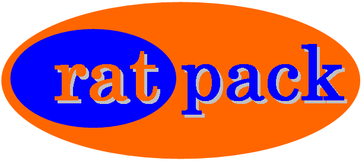

=====================
 ratpack user manual
=====================

+-------------------+----------------------------------------------------------+
| **Title**         | ratpack (VHDL rational arithmetic package).              |
+-------------------+----------------------------------------------------------+
| **Author**        | Nikolaos Kavvadias 2009, 2010, 2011, 2012, 2013, 2014    |
+-------------------+----------------------------------------------------------+
| **Contact**       | nikos@nkavvadias.com                                     |
+-------------------+----------------------------------------------------------+
| **Website**       | http://www.nkavvadias.com                                |
+-------------------+----------------------------------------------------------+
| **Release Date**  | 29 November 2014                                         |
+-------------------+----------------------------------------------------------+
| **Version**       | 0.3.3                                                    |
+-------------------+----------------------------------------------------------+
| **Rev. history**  |                                                          |
+-------------------+----------------------------------------------------------+
|        **v0.3.3** | 2014-11-29                                               |
|                   |                                                          |
|                   | Added project logo in README.                            |
+-------------------+----------------------------------------------------------+
|        **v0.3.2** | 2014-10-14                                               |
|                   |                                                          |
|                   | Replaced COPYING by LICENSE.                             |
+-------------------+----------------------------------------------------------+
|        **v0.3.1** | 2014-09-22                                               |
|                   |                                                          |
|                   | New features and changes:                                |
|                   |                                                          |
|                   | - Testing of max, rmin (min), rmax (max).                |
|                   | - Automatic end of simulation (via forced assert).       |
|                   | - Renamed run.sh to ghdl.sh.                             |
|                   | - Added mti.sh and ratpack_tb1/tb2.do for Modelsim.      |
|                   | - README update.                                         |
+-------------------+----------------------------------------------------------+
|        **v0.3.0** | 2014-09-22                                               |
|                   |                                                          |
|                   | Updated for github (contents of /doc moved to top-level  |
|                   | directory, minor documentation changes).                 |
+-------------------+----------------------------------------------------------+
|        **v0.2.0** | 2014-02-21                                               |
|                   |                                                          |
|                   | Changed documentation format to RestructuredText.        |
|                   | Code has been reorganized into new directory structure.  |
+-------------------+----------------------------------------------------------+
|        **v0.1.3** | 2010-11-17                                               |
|                   |                                                          |
|                   | Added max, min.                                          |
+-------------------+----------------------------------------------------------+
|        **v0.1.2** | 2010-11-17                                               |
|                   |                                                          |
|                   | Added gcditer (iterative GCD using rational numbers).    |
+-------------------+----------------------------------------------------------+
|        **v0.1.1** | 2010-06-07                                               |
|                   |                                                          |
|                   | Minor update in documentation (README).                  |
+-------------------+----------------------------------------------------------+
|        **v0.1.0** | 2010-05-14                                               |
|                   |                                                          |
|                   | First public release.                                    |
+-------------------+----------------------------------------------------------+

1. Introduction
===============

``ratpack`` is a rational arithmetic package written in VHDL.

Currently, the ``ratpack`` package implements the following:

- the RATIONAL data type.

- to_rational: 
  construction function of a rational given two integers
  (numerator and denominator).
  
- int2rat: 
  conversion function of an integer to its rational representation.

- numerator: 
  extracts the numerator of a rational number.

- denominator: 
  extracts the denominator of a rational number.
  
- ``"+"``, ``"-"``, ``"*"``, ``"/"``: 
  implementation of the basic arithmetic operations for rationals.
  
- abs: 
  extracts the absolute value of a given rational number.
  
- max: 
  extracts the maximum of two rationals.

- min: 
  extracts the minimum of two rationals.
  
- ``">"``, ``"<"``, ``">="``, ``"<="``, ``"="``, ``"/="``: 
  overload comparison operators for rationals.
  
- gcd: 
  computes the greatest common divisor of two integers (positive,
  covers the pathological case of division by zero).

- mediant: 
  computes the mediant rational of two given rationals.

``ratpack`` is distributed along with two VHDL testbenches: a simple one 
(``ratpack_tb1.vhd``) and a testbench generating the Farey series of orders 
1 to 12 (``ratpack_tb2.vhd``). An exemplary rational arithmetic ALU has also 
been included but it is currently left untested (not testbench for it).

The ``ratpack`` project can be download from the following OpenCores website: 
http://opencores.org/project,ratpack

An up-to-date version of the ``ratpack`` code base is also maintained on 
Github: http://github.com/nkkav/ratpack.git

2. File listing
===============

The ``ratpack`` distribution includes the following files:
   
+-----------------------+------------------------------------------------------+
| /ratpack              | Top-level directory                                  |
+-----------------------+------------------------------------------------------+
| AUTHORS               | List of ``ratpack`` authors.                         |
+-----------------------+------------------------------------------------------+
| BUGS                  | Bug list.                                            |
+-----------------------+------------------------------------------------------+
| ChangeLog             | A log for code changes.                              |
+-----------------------+------------------------------------------------------+
| LICENSE               | The modified BSD license governs ``ratpack``.        |
+-----------------------+------------------------------------------------------+
| README.rst            | This file.                                           |
+-----------------------+------------------------------------------------------+
| README.html           | HTML version of README.                              |
+-----------------------+------------------------------------------------------+
| README.pdf            | PDF version of README.                               |
+-----------------------+------------------------------------------------------+
| ratpack.png           | PNG image for the ``ratpack`` project logo.          |
+-----------------------+------------------------------------------------------+
| rst2docs.sh           | Bash script for generating the HTML and PDF versions.|
+-----------------------+------------------------------------------------------+
| THANKS                | Acknowledgements.                                    |
+-----------------------+------------------------------------------------------+
| TODO                  | A list of future enhancements.                       |
+-----------------------+------------------------------------------------------+
| VERSION               | Current version of the project sources.              |
+-----------------------+------------------------------------------------------+
| /bench/vhdl           | Testbench source code directory for the package      |
+-----------------------+------------------------------------------------------+
| ratpack_tb1.vhd       | A simple testbench.                                  |
+-----------------------+------------------------------------------------------+
| ratpack_tb2.vhd       | Testbench generating the Farey series (orders 1-12). |
+-----------------------+------------------------------------------------------+
| /rtl/vhdl             | RTL source code directory for the package            |
+-----------------------+------------------------------------------------------+
| ratalu.vhd            | Implementation of a rational arithmetic ALU.         |
+-----------------------+------------------------------------------------------+
| ratpack.vhd           | The rational arithmetic package.                     |
+-----------------------+------------------------------------------------------+
| /sim/rtl_sim          | RTL simulation files directory                       |
+-----------------------+------------------------------------------------------+
| /sim/rtl_sim/out      | RTL simulation output files directory                |
+-----------------------+------------------------------------------------------+
| ratpack_results1.txt  | Output generated by the ``ratpack_tb1.vhd`` tests.   |
+-----------------------+------------------------------------------------------+
| ratpack_results2.txt  | Output generated by the ``ratpack_tb2.vhd`` tests.   |
+-----------------------+------------------------------------------------------+
| /sim/rtl_sim/run      | RTL simulation run scripts directory                 |
+-----------------------+------------------------------------------------------+
| ghdl.sh               | A bash script for running the GNU Makefile for GHDL. |
+-----------------------+------------------------------------------------------+
| mti.sh                | A bash script for running the Mentor Modelsim        |
|                       | simulation for either testbench.                     |
+-----------------------+------------------------------------------------------+
| ratpack.mk            | GNU Makefile for running GHDL simulations.           |
+-----------------------+------------------------------------------------------+
| ratpack_tb1.do        | Modelsim ``.do`` script for running the simulation   |
|                       | for testbench ``ratpack_tb1.vhd``.                   |
+-----------------------+------------------------------------------------------+
| ratpack_tb2.do        | Modelsim ``.do`` script for running the simulation   |
|                       | for testbench ``ratpack_tb2.vhd``.                   |
+-----------------------+------------------------------------------------------+

3. ``ratpack`` usage
====================

Contents of the ``ratpack`` distribution can be simulated using either GHDL or 
Mentor Modelsim using the provided scripts.

3.1. GHDL
---------

The ``ratpack`` package test script for GHDL can be used as follows:

| ``$./ghdl.sh <package/entity name> <test case>``

from within directory ``ratpack/sim/rtl_sim/run``.

After this process, the ``ratpack_results.txt`` file is generated containing 
simulation results.

Here follow some simple usage examples of this bash script.

1. Compile the ``ratpack`` package and do a simple test.

| ``$ cd sim/rtl_sim/run``
| ``$ ./ghdl.sh ratpack 1``

2. Compile the ``ratpack`` package and generate the Farey series.

| ``$ ./ghdl.sh ratpack 2``

3.2 Modelsim
------------

For running the Modelsim simulation, the ``ratpack`` package test script for 
can be used as follows:

| ``$./mti.sh <package/entity name> <test case>``

from within directory ``ratpack/sim/rtl_sim/run``.

1. Compile the ``ratpack`` package and do a simple test.

| ``$ cd sim/rtl_sim/run``
| ``$ ./mti.sh ratpack 1``

As in the GHDL case, a diagnostic text file is produced. The results are copied 
to ``sim/rtl_sim/out/ratpack_results1.txt``

2. Compile the ``ratpack`` package and generate the Farey series.

| ``$ ./mti.sh ratpack 2``

The results are copied to ``sim/rtl_sim/out/ratpack_results2.txt``

4. Prerequisites
================

- Standard UNIX-based tools (tested on cygwin/x86 and MinGW/x64)

  * make
  * bash
  
- GHDL simulator (http://ghdl.free.fr)

  Provides the "ghdl" executable and corresponding simulation environment.

- Alternatively to GHDL, the Mentor Modelsim simulator (http://www.mentor.com)
